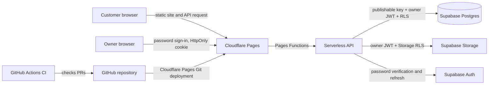

# Cottage 44 architecture

Status: owner workflow implemented; Supabase account setup and hosting remain manual

## Existing repository and deployment

- The public menu and the `/admin/` owner page are plain HTML, CSS, and
  JavaScript under `docs/`.
- Menu data is in `docs/menu.js`. The public page also reads only today's
  plate from the Pages API.
- Cloudflare Pages Functions provide the public daily-plate API and secured
  owner-management endpoints.
- Cloudflare Pages publishes the complete application, including `docs/` and
  `functions/`, at `https://menu.cottage44.co.za/`.

## Proposed architecture



### Frontend

Keep the existing menu and its design. Public pages remain static and do not
require a custom server to be running. The API is a Pages Function, not a
browser Supabase client or a separate frontend application.

The public page requests `/api/plates/today` from the same origin and renders
the plate's name, description, Johannesburg service date, price, and optional
photo. Loading, no-plate, invalid-response, and request-failure states are
handled without exposing server errors; an unavailable image is replaced with
a text fallback. Tests use mocked API responses and do not require Supabase.
For a live preview, Cloudflare Pages must build this feature branch with Pages
Functions enabled, the required Supabase bindings configured, and the plate
migration applied. Verify the preview's `/api/plates/today` route returns
`application/json` with `{ "plate": null }` or a valid current-date plate.
A preview served from an older static-only deployment can return an HTML
fallback for the API path, in which case the page will intentionally show its
safe unavailable message rather than a plate.

### Backend, authentication, and authorization

Use Cloudflare Pages Functions as a serverless API layer in front of Supabase
Postgres. The public API exposes `GET /api/health` and
`GET /api/plates/today`; the latter queries the service date in the
`Africa/Johannesburg` timezone and returns `{ "plate": null }` if none is
assigned. A populated response contains only the plate ID, service date, name,
description, price in cents, and optional HTTPS image URL. Owner routes under
`/api/admin/` provide sign-in, plate create/update/delete, image upload,
history, and today's assignment. They return no database errors, internal
columns, stack traces, or credentials. The browser does not access Supabase
directly.

The Functions use the project URL and a Supabase publishable key from runtime
bindings. The public API exposes only the current South African service date
and the plate fields needed by the menu; it does not expose the catalog or
history. The public site remains usable if the API is unavailable.

`/admin/` uses Supabase Auth email/password verification through the server.
The access and refresh tokens are held only in a `Secure` (on HTTPS),
`HttpOnly`, `SameSite=Strict`, `/api/admin` cookie; the admin JavaScript never
reads or stores them. Mutations require the exact request `Origin` and an
authenticated owner session. A checked **Remember me** choice (default) gives
the cookie a 30-day lifetime; unchecked sessions use a browser-session cookie
without a persistent expiry.
Supabase refresh responses preserve the selected duration.
Password reset requests return the same response for every email and only
send mail to the configured owner. The reset email's one-time token hash is
exchanged by a Pages Function; after it verifies the owner with Supabase, a
short-lived `HttpOnly` recovery cookie is set. The password update validates
that cookie against Supabase again before updating the password. Neither
recovery tokens nor session tokens are exposed to browser JavaScript or
stored in local storage. Supabase Auth's email rate limits apply to reset
requests. If Supabase rejects the send or is unavailable, the page shows a
generic retry-later message rather than saying an email was sent; logs record
only the upstream HTTP status, never its body or the submitted address.

Supabase's built-in SMTP is best-effort and currently permits only two emails
per project per hour, and only to addresses belonging to the Supabase
organization team. The `/auth/v1/recover` endpoint also defaults to a
60-second per-user cooldown. A 429 response is surfaced as a generic
retry-later message; wait at least one minute between attempts and check
**Authentication → SMTP Settings** and **Authentication → Rate Limits**.
For reliable delivery to an address that is not on the organization team,
configure a custom SMTP provider; do not repeatedly request resets to test
delivery.

The server accepts only `corne.dawson@gmail.com`, verified against the
Supabase Auth user email on sign-in and on every request. It does not trust
user-editable metadata. PostgreSQL and Storage RLS independently compare the
verified JWT `email` claim with that owner address for every admin operation.
No service-role key is used or required. Supabase public sign-up must be
disabled manually, and the owner Auth user must be created manually; see the
setup steps below.

### Data and images

Use migrations for the schema. The initial migration creates `plates` and
`daily_plates`, with field constraints, timestamps, a foreign key, an index,
and a primary key ensuring only one plate per service date. Its public RLS
policies allow `anon` to select only the current South African service date
and the referenced plate. It grants no insert, update, or delete permissions.
The owner migration grants authenticated catalog/history access and owner-only
plate and daily-assignment mutations. The history endpoint returns at most the
most recent 365 daily assignments; saved catalog plates remain reusable.

Store images in the `cottage44-plates` Supabase Storage bucket, never in Git.
The bucket is public-read because plate photos are intended for the public
menu; insert/update/delete are restricted by Storage RLS to the owner email.
Uploads accept JPEG, PNG, and WebP only, are limited to 5 MiB, and are checked
against the file signature. Object names are server-generated UUIDs with an
extension derived from the accepted MIME type; original filenames are ignored.
Admin writes only accept public URLs from this bucket.

### Hosting and branch flow

- **Production frontend:** Cloudflare Pages, custom domain
  `menu.cottage44.co.za`, production branch `main`.
- **API:** Cloudflare Pages Functions under `functions/api/`, using the
  Supabase URL and publishable key as runtime bindings.
- **Integration:** feature branches merge through pull requests into `dev`.
  Cloudflare Pages can provide preview deployments for development branches
  and pull requests.
- **Production release:** promote reviewed, CI-passing changes from `dev` to
  `main`; only `main` deploys to the production site.

Cloudflare Pages setup and DNS changes are outside this implementation.

### Current external cutover blocker

The verified `dev.cottage44-menu-pages.pages.dev`,
`cottage44-menu-pages.pages.dev`, and
`menu.cottage44.co.za` deployments serve the menu, admin page, and JSON
Functions correctly. The custom domain is the production hostname; use the
Pages aliases only for deployment and preview diagnostics.

## CI/CD and repository rules

Use GitHub Actions for pull-request checks and branch pushes. The intended gate
is dependency installation, lint, type checking, unit/integration tests, and a
production build; add end-to-end checks as the app gains those workflows. Checks
should run for PRs into both `dev` and `main`, and for pushes to both branches.

Cloudflare Pages' Git integration is the only deployment mechanism. A push to
`main` deploys the complete application through the `cottage44-menu-pages`
project. `.github/workflows/production-smoke.yml` waits for the matching
`Cloudflare Pages` check on that commit, then verifies the production frontend
and `/api/health`. It does not issue a second production deployment.

The Cloudflare preview workflow is intentionally a `pull_request_target` job so
fork PRs can use the repository's Cloudflare secrets. It does not check out or
execute fork code: it downloads the merge-ref archive with the read-only
GitHub token, stages both `docs/` and `functions/`, and deploys the complete
application with Wrangler `4.148.0`. Configure `CLOUDFLARE_API_TOKEN` and
`CLOUDFLARE_ACCOUNT_ID` in the `Cottage44_menu` environment and create the
Pages project `cottage44-menu-pages`. The workflow smoke-tests the immutable
deployment URL and posts the deterministic preview alias
`https://pr-<number>.cottage44-menu-pages.pages.dev` on pull requests.

Protect both `dev` and `main`: require pull requests and successful required CI
checks, do not require a separate approval (the owner chose a solo-friendly
gate), disallow force pushes and branch deletion, and enforce the rules for
administrators. Do not merge a failing or unchecked change. Production
deployment should run only after a validated update reaches `main`.

The repository ruleset must require the meaningful CI and deployment checks
after they have been verified on the protected branch. Do not require obsolete
or static-only deployment statuses.

### Automated Supabase migrations

The existing `.github/workflows/ci.yml` detects migration changes on pushes to
`dev` or `main` after the `checks` job passes. Only when files under
`supabase/migrations/` changed, the `Apply Supabase migrations` job uses the
`Cottage44_menu` GitHub environment and Supabase CLI to link the configured
project and run `supabase db push --linked --yes`. The CLI applies only
migrations missing from that project's migration history. Existing CI check names and the Cloudflare deployment configuration are kept
consistent with the current Pages architecture.

Before the first migration-triggering push, configure the existing GitHub
environment at **Settings → Environments → Cottage44_menu**:

| Kind | Name | Value |
| --- | --- | --- |
| Environment secret | `SUPABASE_ACCESS_TOKEN` | A Supabase personal access token |
| Environment secret | `SUPABASE_DB_PASSWORD` | The database password for the intended Supabase project |
| Environment variable | `SUPABASE_PROJECT_REF` | The project reference from that project's Supabase dashboard URL |

The project ref is an identifier, not a credential. Do not put any of these
values in repository files, workflow YAML, or command output. The secrets and
variable must point to the existing project where the migrations below were
already applied manually.

#### Diagnosing a failed future-date assignment

The owner assignment endpoint permits future dates only when Supabase accepts
the authenticated insert/update under the `daily_plates` owner policies from
`20261007130000_add_future_plate_planning.sql`. A 401/403 response for a
future date is returned to the owner as:

> Future planning is not enabled yet. Please ask the site administrator to
> apply the latest database migration, then try again.

This message does not expose the upstream response. Inspect the push-to-`dev`
workflow before changing code. If the `Apply Supabase migrations` job exits
at its configuration preflight, configure all three values in the
`Cottage44_menu` environment:

- secret `SUPABASE_ACCESS_TOKEN`
- secret `SUPABASE_DB_PASSWORD`
- variable `SUPABASE_PROJECT_REF`

Then verify the target project and migration history. The migration job uses
`supabase db push --linked --yes`; it does not run for pull requests and it
does not run when no migration file changed. Never create a duplicate SQL
migration or apply it to an unintended project.

If linking succeeds but `supabase db push` reports PostgreSQL
**password authentication failed for user postgres**, the configured
`SUPABASE_DB_PASSWORD` is wrong for the project identified by
`SUPABASE_PROJECT_REF` (or contains copied whitespace). Replace that
environment secret with the current database password from the matching
Supabase project's database settings and rerun the workflow. An access token,
publishable key, or dashboard login password is not a database password.
Until `supabase db push` completes successfully, the future-planning policies
are not confirmed as applied and the release must remain blocked.

For the one-time repair, use **Actions → Repair Supabase migration history →
Run workflow**, select the `dev` branch, and enter exactly
`REPAIR_EXISTING_MIGRATIONS`. The workflow is gated by that confirmation,
uses the `Cottage44_menu` environment, reconciles only migration versions
`20261007100000` and `20261007110000`, and then runs
`supabase db push --linked --yes`. It does not expose secrets or allow a
project reference to be entered in the form. A wrong confirmation value
causes the repair job to be skipped.

Supabase may not know about SQL run directly in its SQL editor. Before
automation is used, verify in that exact project that both schemas and policies
from the migrations are already present, then run this one-time history
reconciliation from the repository root. It records the two known migrations
as applied; it does not execute or validate their SQL. Do not run it against a
different or empty project.

```sh
read -rsp "Supabase access token: " SUPABASE_ACCESS_TOKEN
export SUPABASE_ACCESS_TOKEN
printf '\n'
read -rsp "Supabase database password: " SUPABASE_DB_PASSWORD
export SUPABASE_DB_PASSWORD
printf '\n'
read -rp "Supabase project ref: " SUPABASE_PROJECT_REF
export SUPABASE_PROJECT_REF

npx supabase@latest link \
  --project-ref "$SUPABASE_PROJECT_REF" \
  --password "$SUPABASE_DB_PASSWORD"
npx supabase@latest migration repair --status applied \
  20261007100000 20261007110000 \
  --linked

unset SUPABASE_ACCESS_TOKEN SUPABASE_DB_PASSWORD SUPABASE_PROJECT_REF
```

The migration versions correspond to
`20261007100000_create_plates_and_daily_plates.sql` and
`20261007110000_add_owner_admin_and_plate_images.sql`. The `.temp` CLI link
state is ignored by Git. After reconciliation, pushes containing new migration
files to either branch automatically apply pending migrations to the configured
project. Add future schema changes as new, timestamped SQL migration files;
editing an already-applied migration does not reapply it to the database.

## Environment and secrets

The public Supabase URL and publishable/anon key are identifiers intended for
browser use, not secrets; they are safe only when RLS is correctly configured.
`SUPABASE_URL` and `SUPABASE_PUBLISHABLE_KEY` are the only runtime bindings
used by the data Functions. Configure both under Cloudflare Pages **Preview**
and **Production** environments with the same binding names. They identify
the project and are not service credentials; RLS is the security boundary.
The recovery Function also uses `ADMIN_SITE_URL` for the production custom
domain and local development. PR/branch previews do not need a per-deployment
setting: the Function accepts only this Pages project's
`*.cottage44-menu-pages.pages.dev` hostnames and builds the callback from the
current deployment origin. Do not add a service-role key, database password,
JWT signing secret, or deployment token to the app. Keep any unrelated
deployment credentials out of the repository and public build output.

## Cost and operational limits

The target is **R0/month**. Cloudflare Pages and Supabase Free are the selected
tiers; Pages Functions use Cloudflare Workers quotas, which should be checked
against current limits before launch. Supabase Free currently lists 50,000
monthly active users, 500 MB database, 5 GB egress, 5 GB cached egress, and 1
GB file storage. Free projects may be paused after one week of inactivity and
the free plan is limited to two active projects.

Expected usage is one small restaurant menu, one current plate image, and
occasional owner updates; compress images and monitor usage to keep within the
free limits. Exceeding free quotas may require reducing usage or deliberately
upgrading a plan. Do not add a payment method, enable paid features, or upgrade
without the owner's explicit approval. Plan limits and terms can change, so
verify them during account setup. Free-tier pauses and lack of paid-tier
backups are operational trade-offs; establish an export/recovery procedure
before relying on production data.

References checked 7 October 2026:

- [Supabase pricing and free-plan limits](https://supabase.com/pricing)
- [Cloudflare Workers and Pages pricing](https://developers.cloudflare.com/workers/platform/pricing/)

## Local setup and manual account steps

1. In the intended Supabase project, disable public user registration in
   **Authentication → Settings → User Signups** (“Allow new users to sign up”).
   Keep sign-in enabled.
2. Create the owner in **Authentication → Users → Add user** with the exact
   email `corne.dawson@gmail.com` and a strong, unique password. Confirm the
   email in the dashboard if the project requires confirmation. Do not grant
   access through user-editable metadata. Password resets are managed through
   Supabase Auth.
3. The migrations
   `20261007100000_create_plates_and_daily_plates.sql` and
   `20261007110000_add_owner_admin_and_plate_images.sql` have already been
   applied manually to the existing Supabase project. If setting up automation
   for that project, follow the one-time migration-history reconciliation
   above before adding or pushing future migrations.
4. For local development, run `npm ci`, copy `.env.example` to `.dev.vars`,
   and replace placeholders locally (do not commit the file):

   ```dotenv
   SUPABASE_URL=https://your-project-ref.supabase.co
   SUPABASE_PUBLISHABLE_KEY=sb_publishable_replace_with_project_key
   ```

   Start local Pages with `npm run dev`; `.dev.vars` is Git-ignored. Use only
   the URL and publishable key—never put a service-role key in `.dev.vars`.
5. In Cloudflare Pages **Settings → Variables and Secrets**, add
   `SUPABASE_URL` and `SUPABASE_PUBLISHABLE_KEY` separately to both the
   **Preview** and **Production** environments, using the values from the
   intended Supabase project. The variable names are identical in both
   environments. Do not add service-role credentials.
6. Deploy the reviewed branch to Cloudflare Pages before using `/admin/`.
   Runtime configuration values are managed in Cloudflare and are not written
   into this repository.
7. In Cloudflare Pages **Settings → Variables and Secrets**, set the non-secret
   `ADMIN_SITE_URL` binding in **Production** to
   `https://menu.cottage44.co.za` (origin only, no path). Do not set it per
   Preview deployment: the recovery Function dynamically uses the request
   origin only when it is the explicit configured production origin, local
   origin, or under the exact project-owned
   `cottage44-menu-pages.pages.dev` domain. For local Pages, use
   `http://127.0.0.1:8788` in `.dev.vars`.
8. In Supabase **Authentication → URL Configuration**, set **Site URL** to
   `https://menu.cottage44.co.za` and add these under **Redirect URLs**:
   `https://menu.cottage44.co.za/api/admin/password-recovery/verify` and
   `https://*.cottage44-menu-pages.pages.dev/api/admin/password-recovery/verify`
   (covers branch and immutable PR previews for this Pages project). Add
   `http://127.0.0.1:8788/api/admin/password-recovery/verify` only for local
   development.
9. In Supabase **Authentication → Email Templates → Reset Password**, make
   the reset link point to the redirect URL with the one-time token hash,
   rather than the default confirmation URL:

   ```html
   <a href="{{ .RedirectTo }}?token_hash={{ .TokenHash }}&amp;type=recovery">Reset password</a>
   ```

   The function verifies this recovery token and owner account before it
   displays the new-password form. The email URL is one-time; if it expires,
   request another reset email.
10. If reset mail does not arrive, first check **Authentication → SMTP
    Settings** and **Authentication → Rate Limits**. Supabase's built-in SMTP
    only sends to organization-team addresses and is limited to two emails
    per project per hour; `/auth/v1/recover` also applies a default 60-second
    per-user cooldown. Wait before another attempt. For delivery to other
    addresses or production use, configure a custom SMTP provider in Supabase
    **Authentication → SMTP Settings**.
